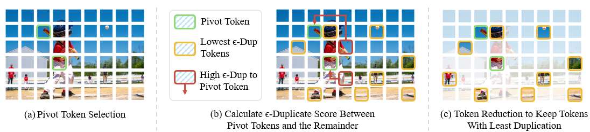

<div align="center">
  <h1 style="display: inline-block; margin: 0;">🚀Stop Looking for Important Tokens in Multimodal Language Models: Duplication Matters More</h1>
</div>

<h4 align="center"> 

[Zichen Wen](https://scholar.google.com/citations?user=N-aPFvEAAAAJ&hl=zh-CN)<sup>1,2</sup>,
Yifeng Gao<sup>1</sup>,
[Shaobo Wang](https://gszfwsb.github.io/)<sup>1</sup>,
[Junyuan Zhang](https://scholar.google.com/citations?user=uwwqEg8AAAAJ&hl=en)<sup>2</sup>,
Qintong Zhang<sup>2,4</sup>, <br>
[Weijia Li](https://liweijia.github.io/)<sup>3,2</sup>,
[Conghui He](https://conghui.github.io/)<sup>2✉</sup>,
[Linfeng Zhang](http://www.zhanglinfeng.tech/)<sup>1✉</sup>,


<sup>1</sup>Shanghai Jiao Tong University, <sup>2</sup>Shanghai AI Laboratory, <br>
<sup>3</sup>Sun Yat-sen University, <sup>4</sup>Peking University

</h4>

<div align="center">

[](https://arxiv.org/pdf/2502.11494)
[](https://hits.seeyoufarm.com)
[](https://github.com/ZichenWen1/DART/issues)
[](https://github.com/ZichenWen1/DART/stargazers)
</div>

## 🔥 News
* **`2025.02.22`** 🤗🤗 We release our latest work [DART](https://arxiv.org/pdf/2502.11494), a plug-and-play, training-free token reduction method that seamlessly integrates with efficient attention operators. [Code](https://github.com/ZichenWen1/DART) is available!
* **`2025.03.18`** 🤗🤗 We have released the implementation of DART for Qwen2-VL, and now you can easily evaluate it using [lmms-eval](https://github.com/EvolvingLMMs-Lab/lmms-eval)!
* **`2025.03.19`** 🤗🤗 The implementation and [evaluation scripts](https://github.com/ZichenWen1/DART/tree/main/scripts/v1_6/eval) for LLaVA-Next are now available!

## 👀 Overview
<p align='center'>

</p>

> **TLDR:** We propose DART (Duplication-Aware Reduction of Tokens), a training-free method that prunes vision tokens based on duplication, achieving 88.9% token reduction and 1.99
 speed-up while maintaining performance and compatibility with efficient attention operators.

## 🛠 Preparation
### LLaVA
1. Clone this repository.

```bash
git clone https://github.com/ZichenWen1/DART
cd DART
```

2. Environment Setup and Preparation

```Shell
 conda create -n DART python=3.10 -y
 conda activate DART
 pip install -e .
 pip install flash-attn --no-build-isolation
```

3. Download Multimodal Benchmark

Please follow the detailed instruction in [LLaVA-Evaluation](https://github.com/haotian-liu/LLaVA/blob/main/docs/Evaluation.md).

### Qwen2-VL
```bash
 conda create -n DART_Qwen2VL python=3.10 -y
 conda activate DART_Qwen2VL
 cd Qwen2-VL/transformers && pip install -e .
 pip install accelerate qwen-vl-utils[decord]
 pip install flash-attn --no-build-isolation
 cd lmms-eval && pip install -e .
```

## 🎯 Usage
### LLaVA
### 📖 Script Templates
```shell
bash scripts/v1_5/eval/[Benchmark].sh [Reduction_Ratio] [Max_Num_Trunction]
```

### 🐝 Examples
```Shell
CUDA_VISIBLE_DEVICES=0 bash scripts/v1_5/eval/textvqa.sh 0.778 128
```

```Shell
CUDA_VISIBLE_DEVICES=0 bash scripts/v1_5/eval/pope.sh 0.778 128
```

```Shell
CUDA_VISIBLE_DEVICES=0 bash scripts/v1_5/eval/mme.sh 0.778 128
```

### Qwen2-VL
### 🐝 Examples
```bash
cd Qwen2-VL
bash eval_scripts/lmms_eval.sh True [Reduction_Ratio]
```


## 🔑 License

This project is released under the [Apache 2.0 license](LICENSE).

## 📌 Citation

Please consider citing our paper in your publications, if our findings help your research.
```bibtex
@article{wen2025stop,
  title={Stop Looking for Important Tokens in Multimodal Language Models: Duplication Matters More},
  author={Wen, Zichen and Gao, Yifeng and Wang, Shaobo and Zhang, Junyuan and Zhang, Qintong and Li, Weijia and He, Conghui and Zhang, Linfeng},
  journal={arXiv preprint arXiv:2502.11494},
  year={2025}
}
```


## 👍 Acknowledgment
We extend our gratitude to the open-source efforts of [LLaVA](https://github.com/haotian-liu/LLaVA), [Qwen2-VL](https://github.com/QwenLM/Qwen2-VL), and [lmms-eval](https://github.com/EvolvingLMMs-Lab/lmms-eval).


## 📩 Contact
For any questions about our paper or code, please email `zichen.wen@outlook.com`.

